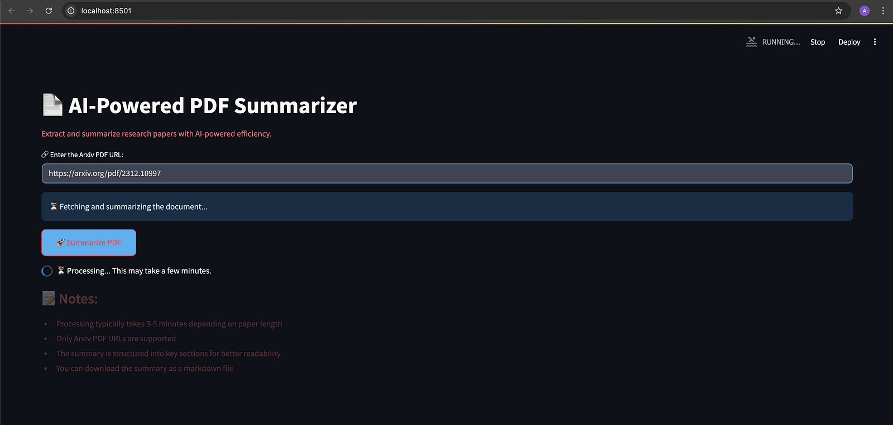

# AI-Powered PDF Summarizer

AI-Powered PDF Summarizer is a tool that extracts and summarizes research papers from ArXiv PDFs using Ollama (Gemma 3 LLM). The system generates structured, downloadable summaries to help researchers and students quickly understand technical papers.



---

## Features

* Input an ArXiv PDF URL to fetch and summarize papers
* Extracts technical content including architecture, implementation, and results
* Optimized for large text processing with parallel summarization
* Modern interface built with Streamlit
* Download summaries as Markdown files

---

## Tech Stack

| Component      | Technology                               |
| -------------- | ---------------------------------------- |
| Frontend       | Streamlit                                |
| Backend        | FastAPI                                  |
| LLM Platform   | Ollama                                   |
| LLM Model      | Google Gemma 3                           |
| PDF Processing | PyMuPDF (fitz)                           |
| Text Chunking  | LangChain RecursiveCharacterTextSplitter |

---

## Installation & Setup

### 1. Clone the Repository

```bash
git clone https://github.com/vishavjeetkath/ai-pdf-summarizer.git
cd ai-pdf-summarizer
```

### 2. Install Dependencies

```bash
pip install -r requirements.txt
```

### 3. Install Ollama and Gemma 3

Install Ollama:

```bash
curl -fsSL https://ollama.com/install.sh | sh
```

Pull the Gemma 3 model:

```bash
ollama pull gemma3:27b
```

### 4. Start the Backend

```bash
uvicorn main:app --host 0.0.0.0 --port 8000 --reload
```

### 5. Start the Frontend

```bash
streamlit run frontend.py
```

---

## API Endpoints

### Health Check

```http
GET /health
```

Response:

```json
{
  "status": "ok",
  "message": "FastAPI backend is running!"
}
```

### Summarize an ArXiv Paper

```http
POST /summarize_arxiv/
```

Request Body:

```json
{
  "url": "https://arxiv.org/pdf/2401.02385.pdf"
}
```

Response:

```json
{
  "summary": "Structured summary of the research paper..."
}
```

---

## Project Structure

```text
.
├── frontend.py
├── main.py
├── requirements.txt
├── README.md
└── PDF_Summarizer.png
```

---

## Future Improvements

* Multi-PDF summarization
* Chat with PDF functionality
* Vector database integration
* User authentication
* Docker deployment
* Citation extraction and highlighting
